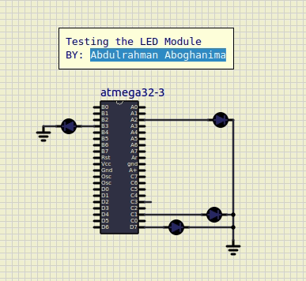
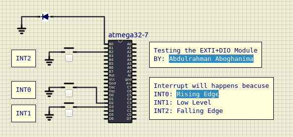
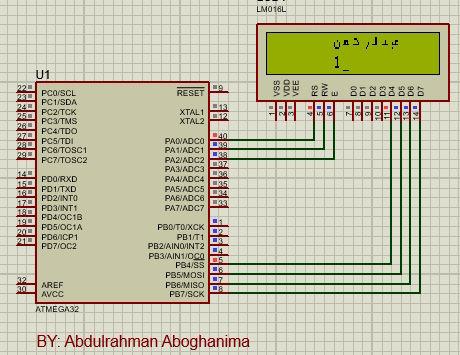
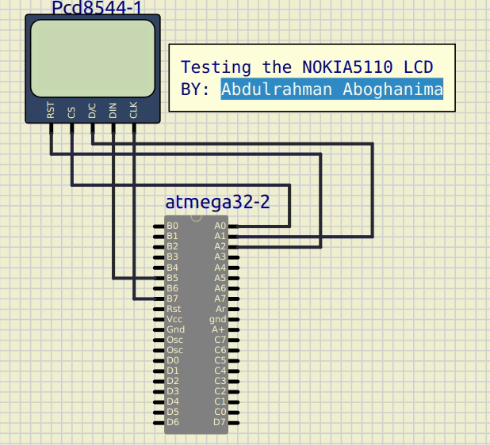
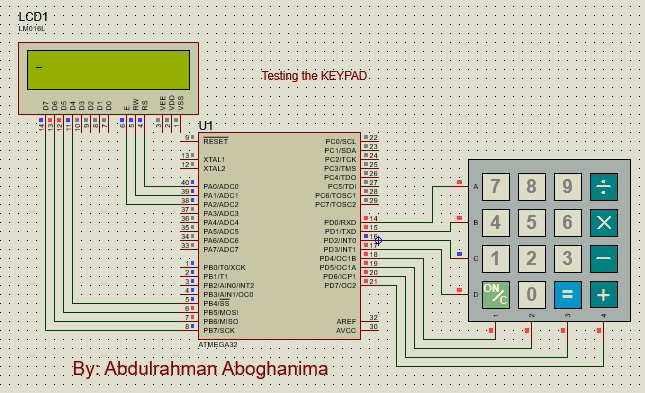
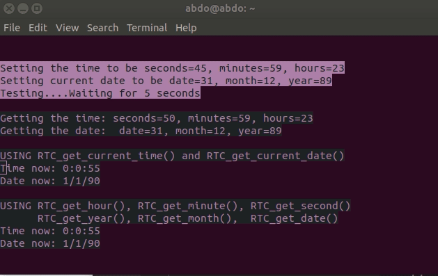
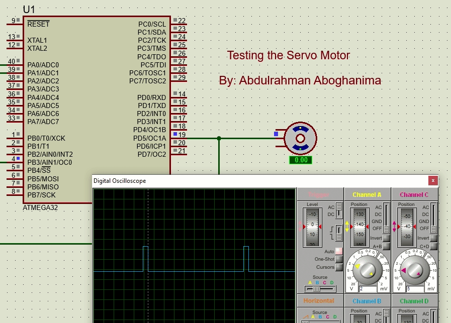
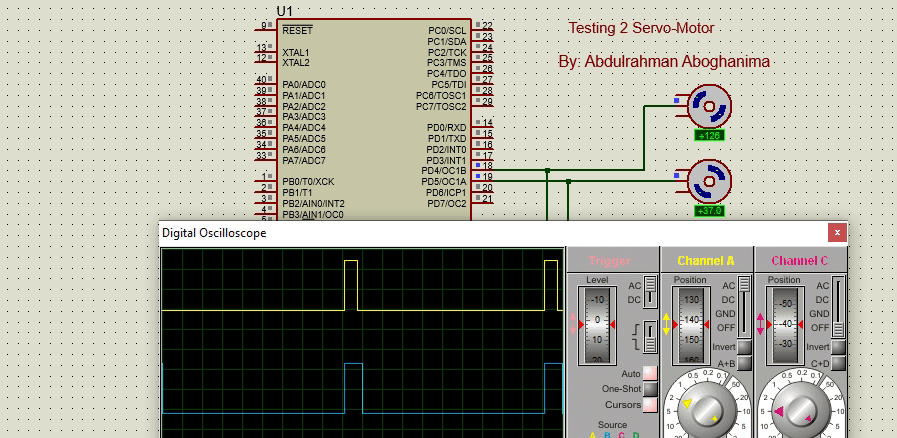
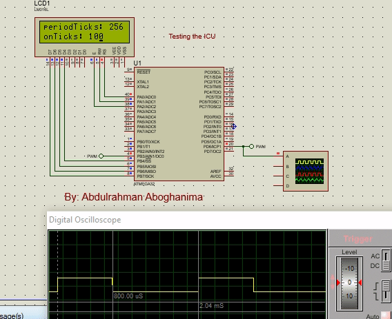
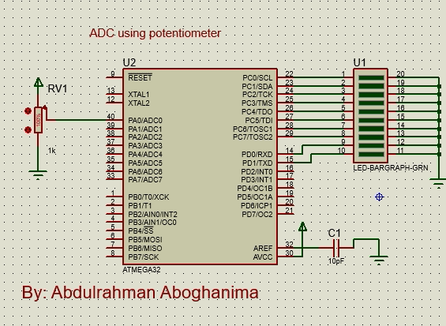

# This folder contains some tests for modules working together 

## A LED

The *Hello World* of the embedded systems world is blinking an LED.

Here is an LED module that has APIs that turns off, turns on and toggle an LED.

The LED is a data structure that has 3 members; `port`, `pin` and `state`.
1. `port` : The port which the LED is connected to.
2. `pin`  : The pin which the LED connected to.
3. `state`: The current state of the LED whether it's on or off.




## EXTI+DIO, External Interrupt + Digital I/O modules

In this test, I used `EXTI`, external interrupt, module and the `DIO`, Digital I/O, 
To make an interrupt that blinks a LED.


The ISR of the 3 interrupt sources executes the following routine:
```
void routine(void)
{
  DIO_SetPinValue(DIO_PORTB, DIO_PIN0, DIO_PIN_LOW);
  _delay_ms(500);
  DIO_SetPinValue(DIO_PORTB, DIO_PIN0, DIO_PIN_HIGH);
  _delay_ms(500);
}
```

The ISR of every external interrupt will be triggered if there is:
1. Rising Edge on `INT0`
2. Low Level on `INT1`
3. Falling Edge `INT1`




## LCDs

### 16*2 Crystal LCD
In this test, I use the LCD in the 4-bit mode to show some strings, numbers, and special characters.



### Nokia 5110 Graphical LCD using SPI, Serial peripheral interface.
In this test, I use the NOKIA5110 graphical LCD showing some strings, numbers, and a photo.




### KEYPAD+CLCD 
In this test, I used a keypad to print its characters on the CLCD.
**Note**: you can configure the characters of the Keypad using the 
configuration file `KEYPAD_config.h`
In this simulation I used the configuration as following
```
#define KEYPAD_ARRAY {\
		      {'7', '8', '9', '/'},\
		      {'4', '5', '6', '*'},\
		      {'1', '2', '3', '-'},\
		      {'O', '0', '=', '+'}}
```





## RTC+USART, Real Time Clock + USART module.

Setting and Getting the data from *RTC* and sending it to the *USART*.




## SERVO motor 

Moving the Rotor of the servo motor between 0, 45, 90, 180
with waiting 1 sec between each angle.



Moving two servo motors together.




## TIMERS

### ICU+CLCD, Input Capture Unit,

In the `TIMER_ICU+CLCD_test.c` file, `timer0` is configured in the fast PWM mode 
to generate a PWM signal,
the on time of the signal equals to 100 tick and the period time equals to 256 tick.

`timer1` is used by the ICU by getting its reading when an event (falling edge or rising edge) 
happens to the input signal.

Both timers input clocks are prescaled by 64. 

```Tick time = 1/(F_CPU/64) =64/8MHz = 8 uS```

So the period time of the signal = 256 * 8 uS = 2.048 mS as shown in the figure.




## ADC

In this program, I used an ADC resolution of 10 bits, and used a potentiometer as
an analog signal source. After the conversion, the 10 bits are displayed using 10 bits;
8 from `PORTC` and 2 from `PORTD`.

